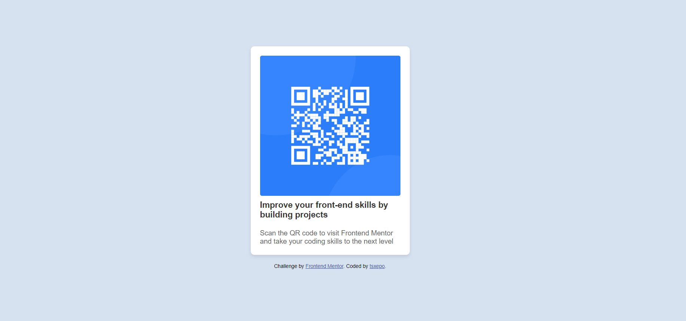

# Frontend Mentor - QR code component solution

This is a solution to the [QR code component challenge on Frontend Mentor](https://www.frontendmentor.io/challenges/qr-code-component-iux_sIO_H). Frontend Mentor challenges help you improve your coding skills by building realistic projects.

## Table of contents

- [Overview](#overview)
  - [Screenshot](#screenshot)
  - [Links](#links)
  - [Built with](#built-with)
  - [Continued development](#continued-development)
- [Author](#author)

## Overview

### Screenshot

### Links

- Solution URL: [github](https://github.com/tsxepo-web/qr-code-component.git)
- Live Site URL: [netlify](https://capable-llama-d74a78.netlify.app/)

### Built with

- Semantic HTML5 markup
- Flexbox
- CSS Grid
- [Angular](https://angular.io/) - JS Framework

## Author

- Frontend Mentor - [@tsxepo](https://www.frontendmentor.io/profile/tsxepo-web)
